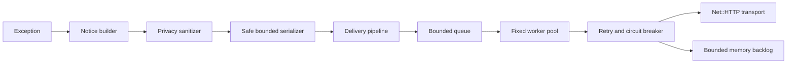

# Chronos Ruby

Chronos Ruby is the framework-independent client for sending Ruby application errors and bounded telemetry to Chronos. Version 0.5 adds legacy Rails 4.2 and 5.2 installation, controller exception deduplication, and allowlisted request, query, job, and cache events to the Rack, privacy, and resilience foundations from earlier releases.

## What the gem collects

For each exception, version 0.5 can collect:

- exception class, message, structured backtrace, and chained causes;
- timestamp, severity, tags, and an optional fingerprint;
- application-supplied context, parameters, session, and user fields;
- Ruby version, engine, platform, process ID, opaque thread ID, and hostname;
- application version, environment, and service name.
- Rack method, normalized route, status, duration, request ID, host, query-free path, optional user agent, controller/action, response size, trace ID, and already-parsed parameters when the middleware is used;
- bounded breadcrumbs explicitly supplied by the application or integration.

See [Data collected](docs/data-collected.md) for the complete field table.

## What is not collected by default

Chronos Ruby does not inspect environment variables, request bodies, cookies, HTTP headers, source code, database contents, or installed gems. Application-supplied fields are recursively sanitized, but applications should still avoid sending unnecessary personal, health, financial, or authentication data.

## Supported Ruby and Rails versions

Version 0.x targets Ruby 2.2.10 through Ruby 2.6. Version 0.5 provides best-effort Rails 4.2 through 5.2 integration through public framework APIs and feature detection. All supported combinations must pass dedicated CI before being listed as supported.

See [Compatibility](docs/compatibility.md).

## Plain Ruby installation

The current public build is a pre-release. Add its exact version to the application's `Gemfile`:

```ruby
gem "chronos-ruby", "0.5.0.pre.1"
```

Install with a Bundler version compatible with the application. For the oldest supported runtime:

```bash
gem install bundler -v 1.17.3
bundle _1.17.3_ install
```

Without Bundler:

```bash
gem install chronos-ruby --pre
```

## Rails installation

Version 0.5 exposes Rails support explicitly, keeping Rails and ActiveSupport out of plain Ruby applications:

```ruby
gem "chronos-ruby", "0.5.0.pre.1", :require => "chronos/rails"
```

Generate the initializer with:

```bash
rails generate chronos:install
```

The Railtie installs the Rack middleware and notification subscribers idempotently. Automatic integration is disabled in test and console by default and can be controlled with `rails_enabled`, `rails_capture_in_test`, `rails_capture_in_console`, and `rails_capture_user_agent`. See [Rails 4.2 and 5.2 integration](docs/modules/rails-legacy.md).

## Minimum configuration

`project_id`, `project_key`, and an HTTPS `host` are required while the agent is enabled:

```ruby
require "chronos"

Chronos.configure do |config|
  config.project_id = ENV["CHRONOS_PROJECT_ID"]
  config.project_key = ENV["CHRONOS_PROJECT_KEY"]
  config.host = "https://chronos.example.com"
  config.environment = ENV["APP_ENV"] || "production"
  config.service_name = "billing"
  config.app_version = ENV["APP_VERSION"]
end
```

HTTPS verification is enabled by default. HTTP requires explicitly setting `ssl_verify = false` and should only be used with a local test server.

## Automatic capture

Rack applications can capture unhandled exceptions automatically and preserve the application error semantics:

```ruby
use Chronos::Integrations::Rack::Middleware,
    :include_user_agent => false
```

The middleware notifies asynchronously and re-raises the same exception. It never reads the request body, raw query string, cookies, authorization headers, or response body. See [Rack integration and context](docs/modules/rack-context.md).

## Manual capture

Asynchronous capture is recommended for application code:

```ruby
begin
  perform_payment
rescue StandardError => error
  Chronos.notify(error, :tags => ["payment"])
  raise
end
```

Synchronous capture waits for the HTTP result and is useful in scripts or controlled shutdown paths:

```ruby
delivered = Chronos.notify_sync(RuntimeError.new("import failed"))
```

Both methods return `false` instead of allowing an internal agent error to escape.

## User context

User data is opt-in and must contain only values your application is allowed to send:

```ruby
Chronos.notify(error, :user => {"id" => "customer-42", "role" => "operator"})
```

Version 0.4 sanitizes this context before delivery and before it can enter retry storage. Data minimization remains the application's responsibility.

## Breadcrumbs

Breadcrumbs use a fixed circular buffer scoped to the current execution:

```ruby
Chronos.add_breadcrumb(
  :category => "custom",
  :message => "payment started",
  :metadata => {"provider" => "example"}
)
```

No log, SQL, HTTP, cache, job, request body, or response body payload is collected automatically. Unknown categories become `custom`, and metadata is bounded and sanitized before queueing.

## Filters and LGPD

Version 0.4 recursively redacts sensitive keys and detects Bearer tokens, JWTs, e-mail addresses, CPF, CNPJ, and valid payment-card candidates in free text. IPv4 addresses are anonymized by default. Applications can add blocklist matchers, hash selected identifiers, or install custom filters:

```ruby
Chronos.configure do |config|
  # required options omitted
  config.blocklist_keys += [:medical_record, /bank_account/i]
  config.hash_keys += [:customer_id]
  config.filters << proc { |key, value| key.to_s == "internal_reference" ? "[REMOVED]" : value }
end
```

Sanitization runs before queueing and transport. See [Privacy and LGPD](docs/privacy-lgpd.md) for behavior, limitations, health and financial examples, and a payload audit procedure.

## Ignore rules

Entire environments can be ignored:

```ruby
Chronos.configure do |config|
  # required options omitted
  config.ignored_environments = ["development", "test"]
end
```

Local exception-specific ignore callbacks are not available in version 0.4. The server may provide a bounded list of exact fingerprints to ignore; it cannot provide regular expressions or executable rules.

## Performance monitoring

Version 0.5 emits bounded `request`, `query`, `job`, and `cache` events from public Rails notifications. SQL text and binds, cache keys and values, job arguments, mail content and recipients, and request or response bodies are never copied. Aggregation, percentiles, query fingerprints, and external HTTP monitoring are not implemented in this version.

## Sidekiq and Active Job

Version 0.5 records bounded Active Job execution telemetry when Active Job is available. It includes the job class, queue, and duration, but excludes job IDs and arguments. Sidekiq-specific integration is not implemented.

## Deploy tracking

Deploy notifications are not implemented in version 0.4. `app_version` may be included in exception events for release correlation.

## Asynchronous queue

The queue has a fixed capacity and drops the newest event when full. Worker threads are created lazily after the first accepted event. The default capacity is 100 events with one worker.



Use `Chronos.flush(timeout)` to wait for accepted events and `Chronos.close(timeout)` during shutdown. Workers are recreated after a process fork.

## Retry and backlog

The resilience layer introduced in version 0.3 retries network errors, HTTP `408`, `429`, and `5xx` responses with exponential backoff, bounded jitter, and a finite attempt count. Other `4xx` responses are permanent and are not retried. A circuit breaker pauses requests after repeated failures, preventing retry storms.

After retries are exhausted, the already sanitized `SerializedEvent` may enter a fixed-capacity memory backlog. The backlog drops new items when full, is lost when the process exits, and never writes to disk. A later successful half-open probe drains backlog items as new events arrive.

The SaaS may return a JSON policy in the bounded `X-Chronos-Remote-Configuration` response header. Only sampling rate, enabled event types, a lower payload limit, exact ignored fingerprints, send interval, and kill switch are accepted. Remote values cannot change the host, project credentials, TLS, local maximums, code, or regular expressions. See [Retry and backlog](docs/modules/retry-backlog.md) and [Remote configuration](docs/modules/remote-configuration.md).

## How it works internally

The code follows hexagonal boundaries:

- `Chronos::Core` contains immutable notices, sanitization, and safe normalization;
- `Chronos::Application` coordinates capture;
- `Chronos::Application::DeliveryPipeline` owns bounded retry and remote policy;
- `Chronos::Ports` defines delivery behavior;
- `Chronos::Adapters` implements Net::HTTP delivery and thread-local context;
- `Chronos::Integrations::Rack` implements optional automatic Rack capture;
- `Chronos::Rails` implements the optional Railtie, installer, generator, and public-notification adapters;
- `Chronos::Internal` owns bounded queueing, workers, and defensive logging.

The core has no dependency on Rails, Rack, Sidekiq, or ActiveSupport. See [Architecture](docs/architecture.md).

## Environment-specific configuration

Configuration values are explicit; the gem never scans the process environment. Read only the variables your application chooses:

```ruby
Chronos.configure do |config|
  config.project_id = ENV["CHRONOS_PROJECT_ID"]
  config.project_key = ENV["CHRONOS_PROJECT_KEY"]
  config.host = ENV["CHRONOS_HOST"]
  config.environment = ENV["APP_ENV"] || "production"
  config.enabled = ENV["CHRONOS_ENABLED"] != "false"
  config.queue_size = 100
  config.workers = 1
  config.timeout = 5.0
  config.open_timeout = 2.0
  config.max_retries = 3
  config.retry_base_interval = 0.5
  config.retry_max_interval = 30.0
  config.retry_jitter = 0.25
  config.backlog_size = 100
  config.circuit_failure_threshold = 5
  config.circuit_reset_timeout = 30.0
  config.remote_configuration = true
  config.context_store = :thread_local
  config.breadcrumb_capacity = 20
  config.breadcrumb_max_bytes = 2048
end
```

All options are documented in [Configuration](docs/configuration.md).

## Troubleshooting

Configuration errors are raised during `Chronos.configure`. Capture and delivery errors are contained and optionally reported to the configured logger. Verify credentials, HTTPS certificates, timeouts, and `Chronos.flush` results. See [Troubleshooting](docs/troubleshooting.md).

## Benchmark

Run the version 0.5 benchmarks with:

```bash
bundle _1.17.3_ exec ruby benchmarks/capture_exception.rb
bundle _1.17.3_ exec ruby benchmarks/serialization.rb
bundle _1.17.3_ exec ruby benchmarks/filtering.rb
bundle _1.17.3_ exec ruby benchmarks/queue.rb
bundle _1.17.3_ exec ruby benchmarks/retry_backlog.rb
bundle _1.17.3_ exec ruby benchmarks/request_overhead.rb
bundle _1.17.3_ exec ruby benchmarks/rails_notifications.rb
```

Results depend on runtime, hardware, and payload. No performance comparison is claimed until repeatable measurements are published.

## Migration from Airbrake

An Airbrake migration guide will be added before the legacy 1.0 release. Version 0.5 does not claim API compatibility or automatic replacement.

## Local development

Clone the repository, install Bundler 1.17.3, and run setup:

```bash
gem install bundler -v 1.17.3
bin/setup
```

Open an interactive console:

```bash
bin/console
```

Install the current source locally:

```bash
bundle _1.17.3_ exec rake install
```

## Tests

Run the complete suite on the current Ruby:

```bash
bundle _1.17.3_ exec rake
```

The legacy CI matrix covers Ruby 2.2.10, 2.3.8, 2.4.10, 2.5.9, and 2.6.10. Network integration tests use a local fake HTTP server.

## Contributing

Open an issue before introducing a new public API or dependency. Every public class requires YARD documentation, tests, module documentation, and compatibility evidence. See [CONTRIBUTING.md](CONTRIBUTING.md).

## Security

Never include credentials in event context or logs. Report vulnerabilities privately according to [SECURITY.md](SECURITY.md). Ruby 2.2 through 2.6 are end-of-life; Chronos provides technical compatibility, not runtime security maintenance.

## License

Chronos Ruby is distributed under the terms of the MIT License. See [LICENSE.txt](LICENSE.txt).
