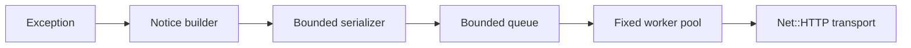

# Chronos Ruby

Chronos Ruby is the framework-independent client for sending Ruby application errors to Chronos. Version 0.1 is the legacy foundation: it captures exceptions manually, builds a bounded JSON event, and delivers it synchronously or through a fixed-size asynchronous queue.

## What the gem collects

For each exception, version 0.1 can collect:

- exception class, message, structured backtrace, and chained causes;
- timestamp, severity, tags, and an optional fingerprint;
- application-supplied context, parameters, session, and user fields;
- Ruby version, engine, platform, process ID, opaque thread ID, and hostname;
- application version, environment, and service name.

See [Data collected](docs/data-collected.md) for the complete field table.

## What is not collected by default

Chronos Ruby does not inspect environment variables, request bodies, cookies, HTTP headers, source code, database contents, or installed gems. Version 0.1 does not automatically sanitize application-supplied context. Do not pass passwords, tokens, cookies, personal documents, or payment data. Advanced redaction belongs to version 0.2.

## Supported Ruby and Rails versions

Version 0.x targets Ruby 2.2.10 through Ruby 2.6. Version 0.1 is independent of Rails and does not yet declare support for any Rails integration. All supported combinations must pass dedicated CI before being listed as supported.

See [Compatibility](docs/compatibility.md).

## Plain Ruby installation

After publication, add the gem to the application's `Gemfile`:

```ruby
gem "chronos-ruby", "~> 0.1"
```

Install with a Bundler version compatible with the application. For the oldest supported runtime:

```bash
gem install bundler -v 1.17.3
bundle _1.17.3_ install
```

Without Bundler:

```bash
gem install chronos-ruby
```

## Rails installation

Rails automatic integration is not part of version 0.1. A Rails application may use the plain Ruby API, but this does not constitute declared Rails support. Rack and Rails adapters are planned for later legacy releases.

## Minimum configuration

`project_id`, `project_key`, and an HTTPS `host` are required while the agent is enabled:

```ruby
require "chronos"

Chronos.configure do |config|
  config.project_id = ENV["CHRONOS_PROJECT_ID"]
  config.project_key = ENV["CHRONOS_PROJECT_KEY"]
  config.host = "https://chronos.example.com"
  config.environment = ENV["APP_ENV"] || "production"
  config.service_name = "billing"
  config.app_version = ENV["APP_VERSION"]
end
```

HTTPS verification is enabled by default. HTTP requires explicitly setting `ssl_verify = false` and should only be used with a local test server.

## Automatic capture

Automatic exception capture is not implemented in version 0.1. Applications must call `Chronos.notify` or `Chronos.notify_sync`. Rack, Rails, and worker hooks will be introduced only after their compatibility suites exist.

## Manual capture

Asynchronous capture is recommended for application code:

```ruby
begin
  perform_payment
rescue StandardError => error
  Chronos.notify(error, :tags => ["payment"])
  raise
end
```

Synchronous capture waits for the HTTP result and is useful in scripts or controlled shutdown paths:

```ruby
delivered = Chronos.notify_sync(RuntimeError.new("import failed"))
```

Both methods return `false` instead of allowing an internal agent error to escape.

## User context

User data is opt-in and must contain only values your application is allowed to send:

```ruby
Chronos.notify(error, :user => {"id" => "customer-42", "role" => "operator"})
```

Avoid names, e-mail addresses, documents, tokens, and other personal or secret fields in version 0.1.

## Breadcrumbs

Breadcrumbs are not implemented in version 0.1.

## Filters and LGPD

Version 0.1 limits depth, collection length, string length, backtrace length, and total payload size. It does not provide the recursive sensitive-data filter planned for version 0.2. Review all supplied context before production use. See [Privacy and LGPD](docs/privacy-lgpd.md).

## Ignore rules

Entire environments can be ignored:

```ruby
Chronos.configure do |config|
  # required options omitted
  config.ignored_environments = ["development", "test"]
end
```

Exception-specific ignore rules are not available in version 0.1.

## Performance monitoring

Request, SQL, cache, job, and external HTTP monitoring are not implemented in version 0.1. The local capture pipeline is bounded and HTTP delivery runs outside the caller thread when `Chronos.notify` is used.

## Sidekiq and Active Job

Sidekiq and Active Job integrations are not implemented in version 0.1. Calling the manual API from a job is possible, but automatic capture and deduplication are not yet guaranteed.

## Deploy tracking

Deploy notifications are not implemented in version 0.1. `app_version` may be included in exception events for release correlation.

## Asynchronous queue

The queue has a fixed capacity and drops the newest event when full. Worker threads are created lazily after the first accepted event. The default capacity is 100 events with one worker.



Use `Chronos.flush(timeout)` to wait for accepted events and `Chronos.close(timeout)` during shutdown. Workers are recreated after a process fork.

## Retry and backlog

Version 0.1 classifies network failures, `429`, `4xx`, and `5xx`, but does not retry or persist events. Failed deliveries are dropped after the attempt. Bounded retry and backlog are planned for version 0.3.

## How it works internally

The code follows hexagonal boundaries:

- `Chronos::Core` contains immutable notices and normalization;
- `Chronos::Application` coordinates capture;
- `Chronos::Ports` defines delivery behavior;
- `Chronos::Adapters` implements Net::HTTP delivery;
- `Chronos::Internal` owns bounded queueing, workers, and defensive logging.

The core has no dependency on Rails, Rack, Sidekiq, or ActiveSupport. See [Architecture](docs/architecture.md).

## Environment-specific configuration

Configuration values are explicit; the gem never scans the process environment. Read only the variables your application chooses:

```ruby
Chronos.configure do |config|
  config.project_id = ENV["CHRONOS_PROJECT_ID"]
  config.project_key = ENV["CHRONOS_PROJECT_KEY"]
  config.host = ENV["CHRONOS_HOST"]
  config.environment = ENV["APP_ENV"] || "production"
  config.enabled = ENV["CHRONOS_ENABLED"] != "false"
  config.queue_size = 100
  config.workers = 1
  config.timeout = 5.0
  config.open_timeout = 2.0
end
```

All options are documented in [Configuration](docs/configuration.md).

## Troubleshooting

Configuration errors are raised during `Chronos.configure`. Capture and delivery errors are contained and optionally reported to the configured logger. Verify credentials, HTTPS certificates, timeouts, and `Chronos.flush` results. See [Troubleshooting](docs/troubleshooting.md).

## Benchmark

Run the version 0.1 benchmarks with:

```bash
bundle _1.17.3_ exec ruby benchmarks/capture_exception.rb
bundle _1.17.3_ exec ruby benchmarks/serialization.rb
bundle _1.17.3_ exec ruby benchmarks/queue.rb
```

Results depend on runtime, hardware, and payload. No performance comparison is claimed until repeatable measurements are published.

## Migration from Airbrake

An Airbrake migration guide will be added before the legacy 1.0 release. Version 0.1 does not claim API compatibility or automatic replacement.

## Local development

Clone the repository, install Bundler 1.17.3, and run setup:

```bash
gem install bundler -v 1.17.3
bin/setup
```

Open an interactive console:

```bash
bin/console
```

Install the current source locally:

```bash
bundle _1.17.3_ exec rake install
```

## Tests

Run the complete suite on the current Ruby:

```bash
bundle _1.17.3_ exec rake
```

The legacy CI matrix covers Ruby 2.2.10, 2.3.8, 2.4.10, 2.5.9, and 2.6.10. Network integration tests use a local fake HTTP server.

## Contributing

Open an issue before introducing a new public API or dependency. Every public class requires YARD documentation, tests, module documentation, and compatibility evidence. See [CONTRIBUTING.md](CONTRIBUTING.md).

## Security

Never include credentials in event context or logs. Report vulnerabilities privately according to [SECURITY.md](SECURITY.md). Ruby 2.2 through 2.6 are end-of-life; Chronos provides technical compatibility, not runtime security maintenance.

## License

Chronos Ruby is distributed under the terms of the MIT License. See [LICENSE.txt](LICENSE.txt).
