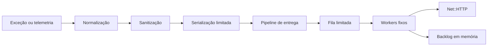

# Chronos Ruby

Chronos Ruby 1.1.1 é o agente independente de framework para enviar exceções e telemetria limitada de aplicações Ruby ao Chronos. Esta é a linha estável legado, compatível com o protocolo v1 e voltada a Ruby 2.2.10–2.6.

## O que a gem coleta

A versão 1.1 pode coletar:

- classe, mensagem, backtrace estruturado e causas encadeadas da exceção;
- timestamp, severidade, tags e fingerprint opcional;
- contexto, parâmetros, sessão e usuário fornecidos pela aplicação;
- versão, engine e plataforma Ruby, PID, thread opaca e hostname;
- ambiente, serviço, versão da aplicação, release, revision, deploy ID, região e instância;
- método, rota normalizada, status, duração e breakdown de requests Rack/Rails;
- SQL normalizado sem literais/binds e sinais heurísticos de desempenho;
- jobs Sidekiq/Active Job, cache, HTTP externo explicitamente instrumentado e dependências carregadas;
- breadcrumbs limitados fornecidos pela aplicação ou por integrações.

Veja a tabela completa em [Dados coletados](docs/data-collected.md).

## O que não é coletado por padrão

A gem não varre variáveis de ambiente, sistema de arquivos ou lockfiles e não coleta bodies HTTP, cookies, headers de autorização, conteúdo de e-mail, SQL bruto, binds, valores de cache ou código-fonte. A inspeção de plano, desativada por padrão, usa o SQL original somente na conexão local para `EXPLAIN` sem `ANALYZE` e o descarta. O inventário de dependências contém somente nomes e versões já carregados, uma vez por agente. A aplicação continua responsável por minimização e base legal dos dados enviados.

## Versões Ruby e Rails suportadas

A versão 1.1.1 suporta Ruby puro e Rack em Ruby 2.2.10, 2.3.8, 2.4.10, 2.5.9 e 2.6.10. As combinações Rails validadas são Rails 4.2 com Ruby 2.2.10/2.3.8 e Rails 5.2 com Ruby 2.5.9/2.6.10. Sidekiq 4.2.10 com Ruby 2.2.10 e Sidekiq 5.2.10 com Ruby 2.5.9 também possuem gates dedicados. Ruby 2.7/Rails 6 não é declarado nesta release porque ainda não possui aplicação e matriz completas.

Rubies e frameworks antigos estão fora do suporte de segurança de seus mantenedores. A Chronos oferece compatibilidade técnica, não manutenção de segurança do runtime. Veja [Compatibilidade](docs/compatibility.md).

## Instalação em Ruby puro

Obrigatório: adicione a versão estável ao `Gemfile`.

```ruby
gem "chronos-ruby", "~> 1.1.1"
```

Em runtimes antigos, use Bundler compatível:

```bash
gem install bundler -v 1.17.3
bundle _1.17.3_ install
```

Sem Bundler:

```bash
gem install chronos-ruby -v 1.1.1
```

## Instalação em Rails

Obrigatório: carregue a integração Rails explicitamente para manter Rails/ActiveSupport fora de aplicações Ruby puras.

```ruby
gem "chronos-ruby", "~> 1.1.1", :require => "chronos/rails"
```

Gere o initializer:

```bash
rails generate chronos:install
```

A Versão 0.5 introduziu Railtie, middleware e subscribers idempotentes por APIs públicas e feature detection. A coleta automática fica desativada em test e console por padrão. Veja [Rails legado](docs/modules/rails-legacy.md).

## Configuração mínima

Obrigatório quando o agente está habilitado: `project_id` e `project_key`. O `host` usa
`https://chronosmonitor.com.br` por padrão. Recomendado: definir ambiente e serviço explicitamente.

```ruby
require "chronos"

Chronos.configure do |config|
  config.project_id = ENV["CHRONOS_PROJECT_ID"]
  config.project_key = ENV["CHRONOS_PROJECT_KEY"]
  config.host = "https://chronosmonitor.com.br"
  config.environment = ENV["APP_ENV"] || "production"
  config.service_name = "billing"
  config.app_version = ENV["APP_VERSION"]
end
```

TLS é verificado por padrão. HTTP exige `ssl_verify = false` explicitamente e deve ser limitado a endpoints locais de teste. Depois de configurar, valide credenciais e ingestão:

```bash
bundle exec rake chronos:verify_integration
```

O task envia uma exceção sintética identificada e só retorna código `0` após uma resposta v1 correlacionada. Em Ruby puro, instale o task com `require "chronos/rake_tasks"` e `Chronos::RakeTasks.install`; por código, use `Chronos.verify_integration`. Veja [Verificação da integração](docs/modules/integration-verification.md).

## Captura automática

Opcional em Rack: instale o middleware. Ele notifica exceções não tratadas, preserva a mesma exceção para a aplicação e não consome bodies.

```ruby
use Chronos::Integrations::Rack::Middleware,
    :include_user_agent => false
```

Em Rails, o Railtie instala middleware e subscribers uma única vez. Veja [Monitoramento de requests](docs/modules/request-monitoring.md).

## Captura manual

Recomendado no fluxo da aplicação: captura assíncrona.

```ruby
begin
  perform_payment
rescue StandardError => error
  Chronos.notify(error, :tags => ["payment"])
  raise
end
```

Opcional para scripts e shutdown controlado: captura síncrona.

```ruby
delivered = Chronos.notify_sync(RuntimeError.new("import failed"))
```

Falhas internas retornam `false` e não escapam para o fluxo principal.

## Contexto de usuário

Contexto de usuário é opt-in. Envie somente campos necessários e autorizados:

```ruby
Chronos.notify(error, :user => {"id" => "customer-42", "role" => "operator"})
```

O valor é limitado e sanitizado, mas a minimização continua sendo responsabilidade da aplicação. Veja [Contexto de execução](docs/modules/context.md).

## Breadcrumbs

Breadcrumbs formam um buffer circular delimitado no escopo atual:

```ruby
Chronos.add_breadcrumb(
  :category => "custom",
  :message => "payment started",
  :metadata => {"provider" => "example"}
)
```

A gem não transforma logs, SQL ou bodies em breadcrumbs brutos. Veja [Breadcrumbs](docs/modules/breadcrumbs.md).

## Filtros e LGPD

A gem bloqueia chaves sensíveis e detecta Bearer tokens, JWTs, e-mails, CPF, CNPJ e candidatos válidos a cartão. IPv4 é anonimizado por padrão. Opcionalmente, amplie a blocklist, aplique hash irreversível ou filtros próprios:

```ruby
Chronos.configure do |config|
  config.blocklist_keys += [:medical_record, /bank_account/i]
  config.hash_keys += [:customer_id]
  config.filters << proc { |key, value| key.to_s == "internal_reference" ? "[REMOVED]" : value }
end
```

Sanitização ocorre antes de fila, retry e backlog. Veja [Privacidade e LGPD](docs/privacy-lgpd.md).

## Ignore rules

Ambientes inteiros podem ser ignorados na configuração. A versão `0.9.0.pre.2` introduziu regras locais limitadas, preservadas na API estável:

```ruby
Chronos.ignore_if do |notice|
  notice.exception_class == "SomeExpectedError"
end
```

A regra recebe um notice normalizado e imutável, e somente `true` descarta. Falhas do callback são contidas. Veja [Ignore rules](docs/modules/ignore-rules.md).

## Monitoramento de performance

A Versão 0.7 introduziu agregação local de requests, queries e jobs em `metric_batch`; a Versão 0.8 adicionou HTTP externo. Grupos possuem contagem, erro, duração, histograma, percentis aproximados, severidades, diagnósticos, status e breakdown limitados.

```ruby
Chronos.configure do |config|
  config.apm_enabled = true
  config.apm_max_groups = 200
  config.apm_flush_count = 100
  config.apm_batch_size = 50
  config.apm_max_queries_per_request = 100
  config.apm_slow_query_threshold_ms = 500.0
  config.apm_n_plus_one_threshold = 5
  config.apm_trace_ttl_seconds = 60.0
  config.apm_query_analysis_enabled = true
  config.apm_query_analysis_max_queries = 100

  # Opt-in: cada fingerprint elegível pode consultar catálogo/estatística/plano.
  config.apm_query_inspection_enabled = false
  config.apm_query_statistics_enabled = false
  config.apm_query_plan_enabled = false
  config.apm_query_inspection_min_duration_ms = 500.0
  config.apm_query_inspection_max_queries = 20
  config.apm_transaction_tracking_enabled = true
  config.apm_transaction_max_connections = 100
end
```

Por padrão, SQL bruto e binds não são lidos pelo pipeline de análise. A inspeção opt-in usa o SQL original apenas localmente para solicitar `EXPLAIN` sem `ANALYZE`; nunca o inclui no evento. A análise estática produz candidatos, não ordens de criação de índice. Erros usam severidade `error`; lentidão e risco usam `warning`; padrões observados usam `info`; correções propostas usam `suggestion`. Veja [APM](docs/modules/apm-aggregation.md), [Requests](docs/modules/request-monitoring.md) e [SQL](docs/modules/sql-monitoring.md).

## Sidekiq e Active Job

A versão `0.6.0.pre.1` introduziu middleware Sidekiq 4/5; a API estável mantém o require explícito:

```ruby
gem "sidekiq", "~> 5.0"
gem "chronos-ruby", "~> 1.1.1", :require => "chronos/sidekiq"
```

O envelope de contexto não altera argumentos públicos e contém somente IDs limitados de trace/request. Active Job usa um campo serializado com namespace (`chronos_context`) e hooks públicos. Erros aninhados são deduplicados e reerguidos. Veja [Sidekiq legado](docs/modules/sidekiq-legacy.md), [Active Job](docs/modules/active-job.md) e [Jobs](docs/modules/job-monitoring.md).

## Deploy tracking

A Versão 0.9 introduziu deploy síncrono e correlação fixa em todos os eventos:

```ruby
Chronos.notify_deploy(
  :environment => "production",
  :revision => ENV["GIT_SHA"],
  :version => ENV["APP_VERSION"],
  :repository => "owner/repository",
  :actor => ENV["DEPLOY_USER"]
)
```

Configure release/revision/deploy na inicialização de cada novo processo. A gem não lê Git ou variáveis automaticamente. Capistrano é opcional; Kamal e GitHub Actions usam exemplos em `examples/deploy/`. Veja [Deploys](docs/modules/deploys.md).

## Fila assíncrona

A fila tem capacidade fixa, descarta o evento mais novo quando cheia e cria workers somente após a primeira captura aceita.


```mermaid
flowchart LR
  E[Exceção ou telemetria] --> N[Normalização]
  N --> P[Sanitização]
  P --> S[Serialização limitada]
  S --> D[Pipeline de entrega]
  D --> Q[Fila limitada]
  Q --> W[Workers fixos]
  W --> H[Net::HTTP]
  W --> B[Backlog em memória]
```

Use `Chronos.flush(timeout)` antes de encerrar e `Chronos.close(timeout)` no shutdown. Workers são recriados após fork. Veja [Fila assíncrona](docs/modules/async-queue.md).

## Retry e backlog

Retry cobre erros de rede, HTTP `408`, `429` e `5xx`, com backoff exponencial, jitter e tentativas limitadas. Outros `4xx` são permanentes. Circuit breaker reduz tempestades de retry.

O backlog guarda somente eventos já sanitizados/serializados, possui capacidade fixa, vive em memória e é perdido no encerramento. Configuração remota aceita apenas sampling, tipos habilitados, limite menor de payload, fingerprints exatas, intervalo e kill switch; nunca altera host, credenciais, TLS ou executa código. Veja [Retry e backlog](docs/modules/retry-backlog.md), [Sampling](docs/modules/sampling.md) e [Configuração remota](docs/modules/remote-configuration.md).

## Configuração por ambiente

A gem não varre o ambiente. Leia somente variáveis escolhidas pela aplicação:

```ruby
Chronos.configure do |config|
  config.project_id = ENV["CHRONOS_PROJECT_ID"]
  config.project_key = ENV["CHRONOS_PROJECT_KEY"]
  config.host = ENV["CHRONOS_HOST"]
  config.environment = ENV["APP_ENV"] || "production"
  config.enabled = ENV["CHRONOS_ENABLED"] != "false"
  config.queue_size = 100
  config.workers = 1
  config.max_retries = 3
  config.backlog_size = 100
  config.remote_configuration = true
  config.apm_enabled = true
  config.external_http_enabled = false
  config.cache_key_mode = :none
  config.dependency_reporting = true
  config.app_version = ENV["APP_VERSION"]
  config.revision = ENV["GIT_SHA"]
  config.deploy_id = ENV["DEPLOY_ID"]
end
```

Todas as opções, defaults e limites estão em [Configuração](docs/configuration.md).

## Troubleshooting

Erros de configuração são levantados durante `Chronos.configure`; falhas de captura/entrega são contidas e podem ir ao logger seguro. Confirme TLS, credenciais, timeouts e retorno de `flush`. Consulte [Troubleshooting](docs/troubleshooting.md).

## Benchmark

O gate estável executa comparação Rack repetível e carga contra endpoint fake:

```bash
ITERATIONS=50000 WARMUP=5000 SAMPLES=7 bundle _1.17.3_ exec ruby benchmarks/comparative.rb
ITERATIONS=500 bundle _1.17.3_ exec ruby benchmarks/fake_endpoint_load.rb
```

Resultados dependem de runtime e hardware. Não há alegação genérica de superioridade; registre CPU, SO, Ruby, commit, warmup, amostras, mediana e dispersão. Outros benchmarks ficam em `benchmarks/` e estão descritos em [Performance](docs/performance.md).

## Migração do Airbrake

Migre por etapas e mantenha os dois agentes juntos somente durante a validação, evitando duplicidade prolongada. Callbacks e notices não são API-compatíveis e devem ser traduzidos/testados explicitamente. Consulte o [guia de migração do Airbrake](docs/migration-from-airbrake.md).

## Desenvolvimento local

Instale Bundler 1.17.3 e as dependências:

```bash
gem install bundler -v 1.17.3
bin/setup
```

Use `bin/console` para inspeção e `bundle _1.17.3_ exec rake install` para instalar a fonte localmente. A arquitetura hexagonal está descrita em [Arquitetura](docs/architecture.md).

## Testes

Execute suíte e lint no runtime atual:

```bash
bundle _1.17.3_ exec rake
```

A matriz CI cobre Ruby 2.2.10–2.6.10, aplicações Rails 4.2/5.2 e Sidekiq 4/5. O workflow de release repete toda a matriz, documentação, benchmark comparativo e carga antes de publicar.

## Contribuição

Abra uma issue antes de adicionar API pública ou dependência. Classes públicas precisam de YARD, testes, documentação de módulo e evidência de compatibilidade. Veja [CONTRIBUTING.md](CONTRIBUTING.md).

## Segurança

Nunca inclua credenciais no contexto. Releases usam Trusted Publishing, checksum SHA-256 e SBOM; dependências passam por auditoria. Reporte vulnerabilidades pelo canal privado de [SECURITY.md](SECURITY.md).

## Licença

Chronos Ruby é distribuída sob a licença MIT. Veja [LICENSE.txt](LICENSE.txt).
