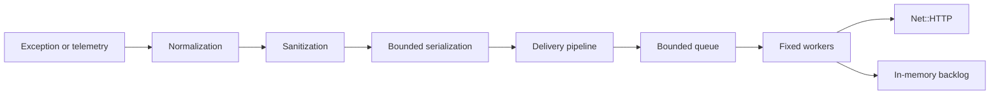

# Chronos Ruby

Chronos Ruby 1.1.4 is a framework-independent agent for sending exceptions and bounded telemetry from Ruby applications to Chronos. This is the stable legacy line, compatible with protocol v1 and targeting Ruby 2.2.10–2.6.

## What the gem collects

Version 1.1 can collect:

- exception class, message, structured backtrace, and chained causes;
- timestamp, severity, tags, and an optional fingerprint;
- context, parameters, session, and user information supplied by the application;
- Ruby version, engine, platform, PID, opaque thread identifier, and hostname;
- environment, service, application version, release, revision, deploy ID, region, and instance;
- Rack/Rails request method, normalized route, status, duration, and timing breakdown;
- normalized SQL without literals or bind values, plus heuristic performance signals;
- Sidekiq/Active Job activity, cache operations, explicitly instrumented outbound HTTP, and loaded dependencies;
- bounded breadcrumbs supplied by the application or integrations.

See the full inventory in [Collected data](docs/data-collected.md).

## What is not collected by default

The agent does not scan environment variables, the filesystem, or lockfiles. It does not collect HTTP bodies, cookies, authorization headers, email contents, raw SQL, bind values, cache values, or source code. Query plan inspection is disabled by default; when enabled, it uses the original SQL only on the local connection for `EXPLAIN` without `ANALYZE`, then discards it. Dependency inventory includes only names and versions of loaded dependencies, once per agent. The application remains responsible for data minimization and the legal basis for sending data.

The explicit deploy CLI described below reads its documented environment variables and optional configuration file. It does not change how the Ruby configuration API works.

## Supported Ruby and Rails versions

Version 1.1.4 targets the existing legacy matrix: it supports plain Ruby and Rack on Ruby 2.2.10, 2.3.8, 2.4.10, 2.5.9, and 2.6.10. Validated Rails combinations are Rails 4.2 with Ruby 2.2.10/2.3.8 and Rails 5.2 with Ruby 2.5.9/2.6.10. Sidekiq 4.2.10 on Ruby 2.2.10 and Sidekiq 5.2.10 on Ruby 2.5.9 also have dedicated gates. This release does not declare Ruby 2.7/Rails 6 support because a complete application fixture and matrix are not available.

These older Rubies and frameworks no longer receive security support from their maintainers. Chronos provides technical compatibility, not runtime security maintenance. See [Compatibility](docs/compatibility.md).

## Installing in plain Ruby

Add the stable version to your `Gemfile`:

```ruby
gem "chronos-ruby", "~> 1.1.4"
```

Use a compatible Bundler on older runtimes:

```bash
gem install bundler -v 1.17.3
bundle _1.17.3_ install
```

Without Bundler:

```bash
gem install chronos-ruby -v 1.1.4
```

## Installing in Rails

Load the Rails integration explicitly to keep Rails/ActiveSupport out of plain Ruby applications:

```ruby
gem "chronos-ruby", "~> 1.1.4", :require => "chronos/rails"
```

Generate the initializer:

```bash
rails generate chronos:install
```

Version 0.5 introduced the Railtie, middleware, and idempotent subscribers through public APIs and feature detection. Automatic collection is disabled in tests and the console by default. See [Legacy Rails](docs/modules/rails-legacy.md).

## Minimal configuration

An enabled agent requires `project_id` and `project_key`. The default `host` is `https://chronosmonitor.com.br`. Set the environment and service explicitly whenever possible.

```ruby
require "chronos"

Chronos.configure do |config|
  config.project_id = ENV["CHRONOS_PROJECT_ID"]
  config.project_key = ENV["CHRONOS_PROJECT_KEY"]
  config.environment = ENV["APP_ENV"] || "production"
  config.service_name = "billing"
  config.app_version = ENV["APP_VERSION"]
end
```

TLS verification is enabled by default. The Ruby API requires an explicit `ssl_verify = false` to use HTTP, which should be restricted to local test endpoints. After configuration, verify credentials and ingestion:

```bash
bundle exec rake chronos:verify_integration
```

The task sends an identified synthetic exception and returns exit code `0` only after a correlated v1 response. In plain Ruby, register the task with `require "chronos/rake_tasks"` and `Chronos::RakeTasks.install`; from Ruby code, use `Chronos.verify_integration`. See [Integration verification](docs/modules/integration-verification.md).

## Automatic capture

For Rack applications, optionally install the middleware. It reports unhandled exceptions, preserves the original exception for the application, and does not consume request bodies.

```ruby
use Chronos::Integrations::Rack::Middleware,
    :include_user_agent => false
```

In Rails, the Railtie installs middleware and subscribers once. See [Request monitoring](docs/modules/request-monitoring.md).

## Manual capture

Use asynchronous capture in application flows:

```ruby
begin
  perform_payment
rescue StandardError => error
  Chronos.notify(error, :tags => ["payment"])
  raise
end
```

Synchronous capture is available for scripts and controlled shutdown:

```ruby
delivered = Chronos.notify_sync(RuntimeError.new("import failed"))
```

Internal capture failures return `false` without escaping into the application's main flow.

## User context

User context is opt-in. Send only necessary, authorized fields:

```ruby
Chronos.notify(error, :user => {"id" => "customer-42", "role" => "operator"})
```

Values are bounded and sanitized, but data minimization remains the application's responsibility. See [Execution context](docs/modules/context.md).

## Breadcrumbs

Breadcrumbs use a bounded ring buffer in the current scope:

```ruby
Chronos.add_breadcrumb(
  :category => "custom",
  :message => "payment started",
  :metadata => {"provider" => "example"}
)
```

The gem does not turn logs, SQL, or bodies into raw breadcrumbs. See [Breadcrumbs](docs/modules/breadcrumbs.md).

## Filters and LGPD

The gem blocks sensitive keys and detects Bearer tokens, JWTs, email addresses, Brazilian CPF/CNPJ identifiers, and valid payment card candidates. IPv4 addresses are anonymized by default. You can extend the blocklist, apply irreversible hashing, or add custom filters:

```ruby
Chronos.configure do |config|
  config.blocklist_keys += [:medical_record, /bank_account/i]
  config.hash_keys += [:customer_id]
  config.filters << proc { |key, value| key.to_s == "internal_reference" ? "[REMOVED]" : value }
end
```

Sanitization happens before queueing, retries, and backlog storage. See [Privacy and LGPD](docs/privacy-lgpd.md).

## Ignore rules

Configuration can exclude entire environments. Version `0.9.0.pre.2` introduced bounded local rules, preserved in the stable API:

```ruby
Chronos.ignore_if do |notice|
  notice.exception_class == "SomeExpectedError"
end
```

Rules receive a normalized, immutable notice. Only `true` discards it, and callback failures are contained. See [Ignore rules](docs/modules/ignore-rules.md).

## Performance monitoring

Version 0.7 introduced local request, query, and job aggregation into `metric_batch`; Version 0.8 added outbound HTTP. Groups contain bounded counts, errors, durations, histograms, approximate percentiles, severities, diagnostics, statuses, and timing breakdowns.

```ruby
Chronos.configure do |config|
  config.apm_enabled = true
  config.apm_max_groups = 200
  config.apm_flush_count = 100
  config.apm_batch_size = 50
  config.apm_max_queries_per_request = 100
  config.apm_slow_query_threshold_ms = 500.0
  config.apm_n_plus_one_threshold = 5
  config.apm_trace_ttl_seconds = 60.0
  config.apm_query_analysis_enabled = true
  config.apm_query_analysis_max_queries = 100

  # Opt-in: each eligible fingerprint may inspect catalogs, statistics, or plans.
  config.apm_query_inspection_enabled = false
  config.apm_query_statistics_enabled = false
  config.apm_query_plan_enabled = false
  config.apm_query_inspection_min_duration_ms = 500.0
  config.apm_query_inspection_max_queries = 20
  config.apm_transaction_tracking_enabled = true
  config.apm_transaction_max_connections = 100
end
```

By default, the analysis pipeline does not read raw SQL or bind values. Opt-in inspection uses the original SQL only locally to request `EXPLAIN` without `ANALYZE`; it never includes that SQL in the event. Static analysis produces candidates rather than instructions to create indexes. Errors use `error` severity; slowness and risks use `warning`; observed patterns use `info`; proposed fixes use `suggestion`. See [APM](docs/modules/apm-aggregation.md), [Requests](docs/modules/request-monitoring.md), and [SQL](docs/modules/sql-monitoring.md).

## Sidekiq and Active Job

Version `0.6.0.pre.1` introduced Sidekiq 4/5 middleware. In Rails, version 1.1.3 detects Sidekiq and automatically installs client and server middleware:

```ruby
gem "sidekiq", "~> 5.0"
gem "chronos-ruby", "~> 1.1.4", :require => "chronos/rails"
```

Ruby applications without Rails still use an explicit `require "chronos/sidekiq"`.

The context envelope preserves public job arguments and contains only bounded trace/request IDs. Active Job uses a namespaced serialized field (`chronos_context`) and public hooks. Nested errors are deduplicated and re-raised. See [Legacy Sidekiq](docs/modules/sidekiq-legacy.md), [Active Job](docs/modules/active-job.md), and [Jobs](docs/modules/job-monitoring.md).

## Deploy tracking

Version 0.9 introduced synchronous deploy reporting and fixed correlation across events:

```ruby
Chronos.notify_deploy(
  :environment => "production",
  :revision => ENV["GIT_SHA"],
  :version => ENV["APP_VERSION"],
  :repository => "owner/repository",
  :actor => ENV["DEPLOY_USER"]
)
```

Configure release/revision/deploy metadata when each new process starts. The Ruby API does not read Git or environment variables automatically. Capistrano is optional; Kamal and GitHub Actions recipes are available in `examples/deploy/`. See [Deploys](docs/modules/deploys.md).

Version 1.1.4 adds a packaged deploy command without a copied Ruby notification script:

```bash
bundle exec chronos deploy notify
```

Supply `CHRONOS_PROJECT_ID`, `CHRONOS_PROJECT_KEY`, `CHRONOS_ENVIRONMENT`, a stable `CHRONOS_DEPLOY_ID`, and `CHRONOS_DEPLOY_REVISION` or `CHRONOS_DEPLOY_VERSION` for the artifact actually published. The CLI reads explicit ENV and optional public YAML without booting Rails. It requires HTTPS and never accepts the project key as a process argument. Optional integration installers cover Kamal, Capistrano, GitHub Actions, GitLab CI, Jenkins, and Azure DevOps.

This branch prepares 1.1.4; publication remains subject to the [release gates](docs/release-1.1.4-readiness.md). See the [CLI guide](docs/deploy-cli.md) for configuration, receipt verification, exit codes, and integration fragments.

## Asynchronous queue

The queue has a fixed capacity, drops the newest event when full, and starts workers only after the first accepted capture.


```mermaid
flowchart LR
  E[Exception or telemetry] --> N[Normalization]
  N --> P[Sanitization]
  P --> S[Bounded serialization]
  S --> D[Delivery pipeline]
  D --> Q[Bounded queue]
  Q --> W[Fixed workers]
  W --> H[Net::HTTP]
  W --> B[In-memory backlog]
```

Use `Chronos.flush(timeout)` before termination and `Chronos.close(timeout)` during shutdown. Workers are recreated after a fork. See [Asynchronous queue](docs/modules/async-queue.md).

## Retry and backlog

Retries cover network errors and HTTP `408`, `429`, and `5xx`, with exponential backoff, jitter, and bounded attempts. Other `4xx` responses are permanent failures. A circuit breaker reduces retry storms.

The backlog stores only sanitized, serialized events. It has a fixed capacity, lives in memory, and is lost on shutdown. Remote configuration accepts only sampling, enabled event types, a smaller payload limit, exact fingerprints, send interval, and a kill switch; it never changes the host, credentials, or TLS settings, or executes code. See [Retry and backlog](docs/modules/retry-backlog.md), [Sampling](docs/modules/sampling.md), and [Remote configuration](docs/modules/remote-configuration.md).

## Environment-based configuration

The Ruby API does not scan the environment. Read only variables chosen by your application:

```ruby
Chronos.configure do |config|
  config.project_id = ENV["CHRONOS_PROJECT_ID"]
  config.project_key = ENV["CHRONOS_PROJECT_KEY"]
  config.environment = ENV["APP_ENV"] || "production"
  config.enabled = ENV["CHRONOS_ENABLED"] != "false"
  config.queue_size = 100
  config.workers = 1
  config.max_retries = 3
  config.backlog_size = 100
  config.remote_configuration = true
  config.apm_enabled = true
  config.external_http_enabled = false
  config.cache_key_mode = :none
  config.dependency_reporting = true
  config.app_version = ENV["APP_VERSION"]
  config.revision = ENV["GIT_SHA"]
  config.deploy_id = ENV["DEPLOY_ID"]
end
```

See [Configuration](docs/configuration.md) for all options, defaults, and limits.

## Troubleshooting

Configuration errors are raised during `Chronos.configure`; capture and delivery failures are contained and may be reported to the safe logger. Check TLS, credentials, timeouts, and the return value of `flush`. See [Troubleshooting](docs/troubleshooting.md).

## Benchmarks

The stable release gate runs a repeatable Rack comparison and load against a fake endpoint:

```bash
ITERATIONS=50000 WARMUP=5000 SAMPLES=7 bundle _1.17.3_ exec ruby benchmarks/comparative.rb
ITERATIONS=500 bundle _1.17.3_ exec ruby benchmarks/fake_endpoint_load.rb
```

Results depend on the runtime and hardware. There is no general claim of superiority: record CPU, OS, Ruby, commit, warmup, samples, median, and dispersion. Additional benchmarks are in `benchmarks/` and documented in [Performance](docs/performance.md).

## Migrating from Airbrake

Migrate in stages. Run both agents together only during validation to avoid prolonged duplicate reporting. Callbacks and notices are not API-compatible and must be translated and tested explicitly. See the [Airbrake migration guide](docs/migration-from-airbrake.md).

## Local development

On a supported legacy Ruby, install Bundler 1.17.3 and the dependencies:

```bash
gem install bundler -v 1.17.3
bin/setup
```

Use `bin/console` for inspection and `bundle _1.17.3_ exec rake install` to install the source locally. See [Architecture](docs/architecture.md) for the hexagonal design.

## Tests

On a supported Ruby with dependencies installed, run the existing suite and lint:

```bash
bundle _1.17.3_ exec rake
```

To also run the deploy CLI, adapter, HTTPS receiver, and installed-package checks, use the legacy CI entry point:

```bash
sh script/ci_legacy
```

The CI matrix covers Ruby 2.2.10–2.6.10, Rails 4.2/5.2 applications, and Sidekiq 4/5. The release workflow repeats the compatibility matrix, documentation checks, comparative benchmark, and load gate before publishing. Tests on a modern Ruby alone do not establish legacy compatibility.

### Prepare Docker

Install Docker Desktop for your platform, start its engine, and run these checks from the repository root:

```bash
# macOS: start Docker Desktop; on other systems, start your Docker engine.
open -a Docker
docker version
docker info
```

`docker version` must show both Client and Server. The commands below require access to the image registry and RubyGems to download images and dependencies. No SaaS credentials are required.

The helper uses `linux/amd64`, including on Apple Silicon through emulation. It mounts the repository read-only and runs tests against a temporary copy inside the container. It excludes local Bundler configuration, credentials directories, and `.env` files, and removes lockfiles only from that copy. Your host Bundler, installed gems, and `Gemfile.lock` remain unchanged.

### Run one Ruby version

Choose any supported version and run its complete legacy checks:

```bash
sh script/test_legacy_docker 2.2.10
sh script/test_legacy_docker 2.3.8
sh script/test_legacy_docker 2.4.10
sh script/test_legacy_docker 2.5.9
sh script/test_legacy_docker 2.6.10
```

Each line is independent. The helper installs Bundler 1.17.3 and dependencies inside the container, then runs `script/ci_legacy`, including the installed-gem smoke tests against a local HTTPS receiver.

### Run all Ruby versions

Run this block to execute the five versions sequentially and stop at the first failure with a nonzero exit status:

```bash
(
  set -e
  for version in 2.2.10 2.3.8 2.4.10 2.5.9 2.6.10; do
    sh script/test_legacy_docker "$version"
  done
)
```

### Run one Rails/Ruby combination

Select one of the documented pairs:

```bash
sh script/test_legacy_docker 2.2.10 examples/rails-4.2
sh script/test_legacy_docker 2.3.8 examples/rails-4.2
sh script/test_legacy_docker 2.5.9 examples/rails-5.2
sh script/test_legacy_docker 2.6.10 examples/rails-5.2
```

Each command runs the Rails application smoke and deploy generator checks. These are separate from the plain Ruby suite; run both groups before approving a release.

### Run the complete Ruby and Rails matrix

Run this block to execute all five Ruby checks followed by all four supported Rails pairs. It stops at the first failure:

```bash
(
  set -e
  for version in 2.2.10 2.3.8 2.4.10 2.5.9 2.6.10; do
    sh script/test_legacy_docker "$version"
  done
  for version in 2.2.10 2.3.8; do
    sh script/test_legacy_docker "$version" examples/rails-4.2
  done
  for version in 2.5.9 2.6.10; do
    sh script/test_legacy_docker "$version" examples/rails-5.2
  done
)
```

Keep the logs for each combination. The helper prints Ruby, OpenSSL, and JSON versions. A stopped matrix does not approve the remaining combinations, and these commands do not run the separate Sidekiq gates or validate SaaS ledger/projection behavior. If certificate or dependency resolution fails, fix the compatible image or dependency versions while keeping HTTPS verification enabled. See the [detailed legacy test environment guide](docs/legacy-test-environment.md).

## Contributing

Open an issue before adding a public API or dependency. Public classes require YARD documentation, tests, module documentation, and compatibility evidence. See [CONTRIBUTING.md](CONTRIBUTING.md).

## Security

Never include credentials in context. Releases use Trusted Publishing, SHA-256 checksums, and an SBOM; dependencies are audited. Report vulnerabilities through the private channel in [SECURITY.md](SECURITY.md).

## License

Chronos Ruby is distributed under the MIT license. See [LICENSE.txt](LICENSE.txt).
