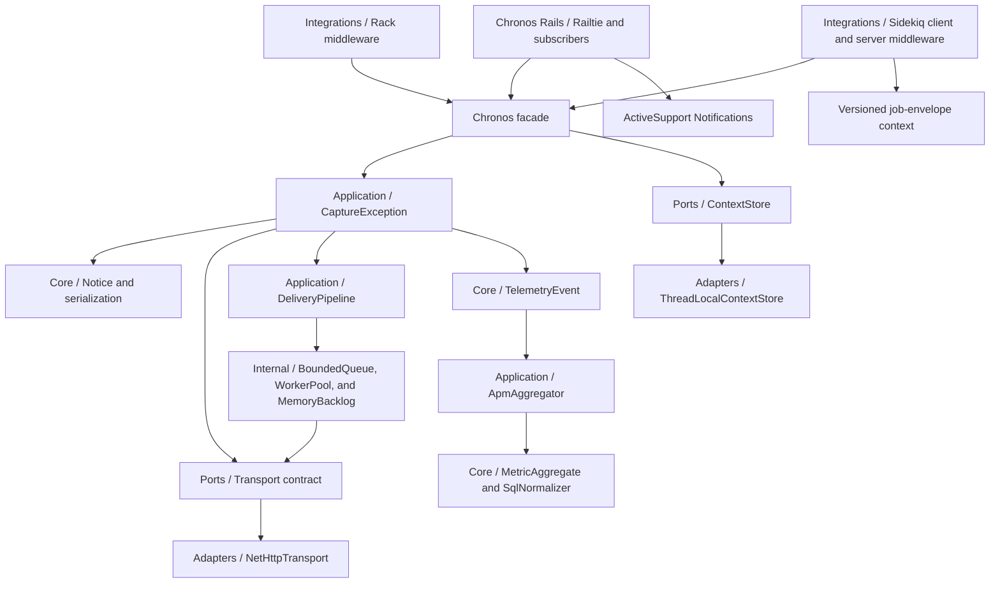

# Architecture

Chronos Ruby 0.7 uses hexagonal boundaries so the legacy core remains independent of frameworks and delivery infrastructure.

## Boundaries

- Domain/Core owns immutable event values and Ruby normalization.
- Application owns use-case ordering and failure containment.
- Ports define behavior expected from transport and execution-context infrastructure.
- Adapters contain Net::HTTP, TLS, and thread-local context behavior.
- Internal contains private concurrency and diagnostic mechanisms.
- Integrations contain optional framework entry points and never enter the domain boundary.
- `Chronos::Rails` contains the optional Railtie, installer, generator, and public-notification adapters.
- `Chronos::Integrations::Sidekiq` contains optional Sidekiq 4/5 middleware and bounded job normalization.

The `Chronos` module is a thin facade. Rails, Rack, ActiveSupport, Sidekiq, and job libraries must not be required by the core.

## Rack capture flow

The Rack middleware establishes a context-store scope, adds a bounded request breadcrumb, and calls the downstream application. An unhandled exception is enriched with request duration and status, captured through the normal notice pipeline, then re-raised unchanged. The context-store adapter restores or clears its value in `ensure`. The middleware implements the Rack protocol without requiring the Rack library.

## Capture flow

An exception becomes an immutable notice. `Sanitizer` removes sensitive values before `SafeSerializer` creates a bounded JSON envelope. Asynchronous capture inserts only that sanitized serialized event into the queue. A fixed worker sends it through `DeliveryPipeline`, which applies finite retry, a circuit breaker, and a fixed memory backlog. Synchronous capture bypasses the queue but uses the same privacy and resilience boundaries.

Rails timings become immutable `TelemetryEvent` values. `CaptureTelemetry` applies the remote/local event policy, `TelemetrySerializer` sanitizes the allowlisted payload, and the resulting `SerializedEvent` enters the same delivery pipeline. Rails classes are loaded only through `chronos/rails`; the core never requires Rails or ActiveSupport.

Sidekiq client middleware writes a versioned, allowlisted trace/request context beside the job's public arguments. Server middleware restores a job scope, limits arguments and tags, emits a job observation, and routes a failure through the existing notice pipeline before re-raising it. Sidekiq retains queue, retry, thread, and connection lifecycle ownership.

Version 0.7 routes request, query, and job observations through `ApmAggregator`. `SqlNormalizer` removes values before grouping, while `MetricAggregate` owns fixed numerical statistics. Aggregates and per-trace query trackers are bounded and mutex-protected. Threshold or lifecycle drains create `metric_batch` telemetry that passes through the existing sanitizer and delivery pipeline. No APM-specific thread is created.

## Failure policy

Explicit invalid configuration raises `Chronos::ConfigurationError`. Capture, serialization, logger, worker, retry, circuit, TLS, network, HTTP, and remote-policy failures do not escape into the host application. They produce `false`, a classified transport result, a bounded state transition, or a bounded logger diagnostic.
