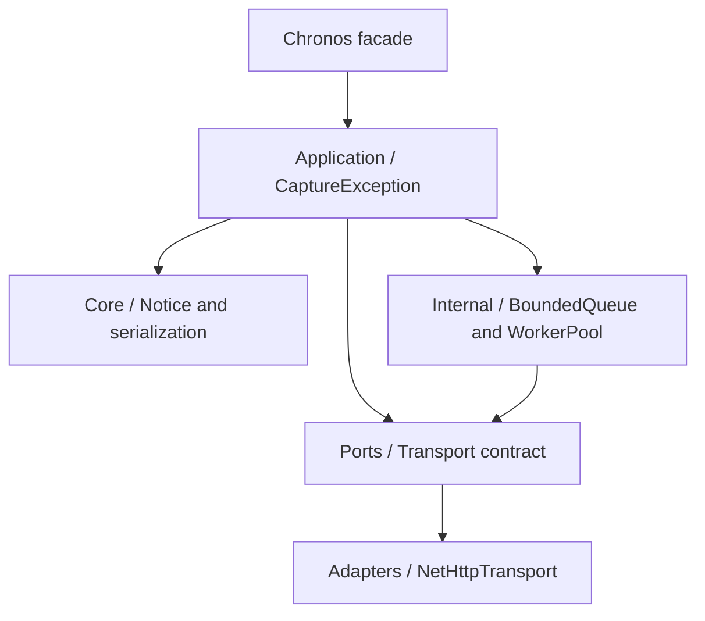

# Architecture

Chronos Ruby 0.1 uses hexagonal boundaries so the legacy core remains independent of frameworks and delivery infrastructure.

## Boundaries

- Domain/Core owns immutable event values and Ruby normalization.
- Application owns use-case ordering and failure containment.
- Ports define behavior expected from infrastructure.
- Adapters contain Net::HTTP and TLS behavior.
- Internal contains private concurrency and diagnostic mechanisms.

The `Chronos` module is a thin facade. Rails, Rack, ActiveSupport, Sidekiq, and job libraries must not be required by the core.

## Capture flow

An exception becomes an immutable notice, then a bounded JSON envelope. Asynchronous capture inserts the serialized event into a bounded queue. A fixed worker sends it through the transport. Synchronous capture bypasses the queue.

## Failure policy

Explicit invalid configuration raises `Chronos::ConfigurationError`. Capture, serialization, logger, worker, TLS, network, and HTTP failures do not escape into the host application. They produce `false`, a transport result, or a bounded logger diagnostic.
