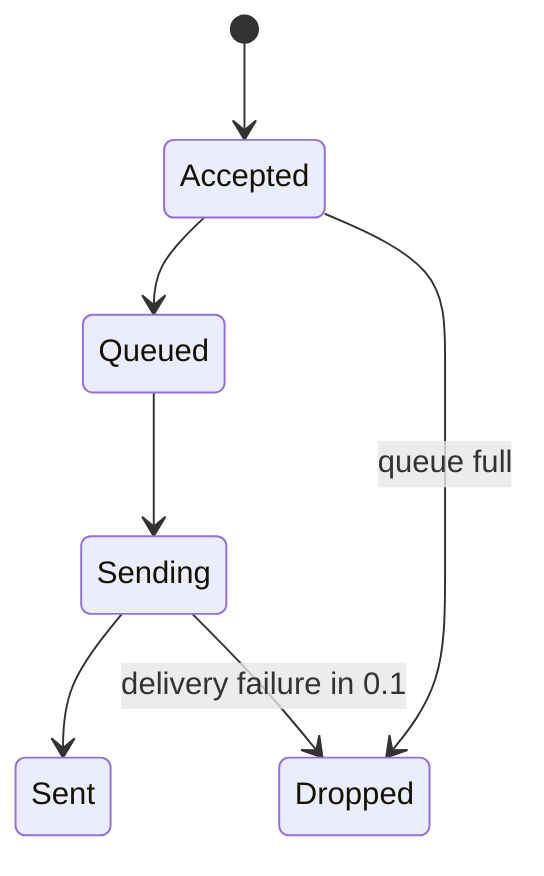

# Asynchronous queue module

`BoundedQueue` stores at most `queue_size` serialized events. When full, it drops the newest event and increments a counter. Producers do not wait for capacity.

`WorkerPool` owns a fixed number of lazy threads. It tracks active deliveries, supports timed flush and close, contains transport errors, and recreates worker references after fork.

Version 0.2 has no disk persistence and no retry. Only sanitized serialized events enter the queue. Queue statistics expose current size, capacity, accepted events, and dropped events. Tests cover full queues, waiter wakeup, lazy startup, contained failures, timed shutdown, double close, flush, and fork behavior.
