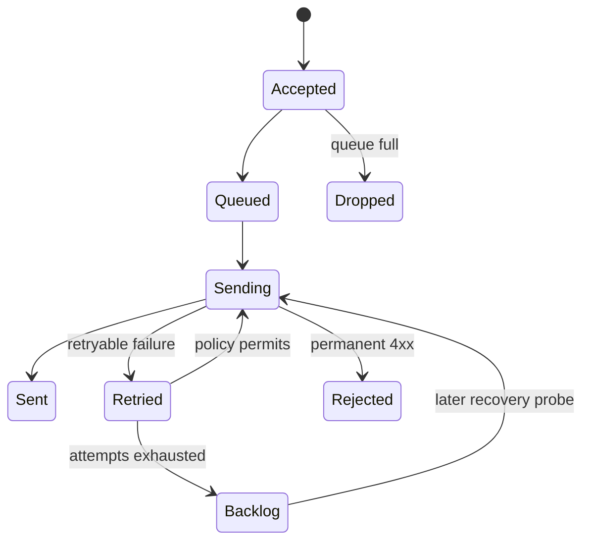

# Asynchronous queue module

`BoundedQueue` stores at most `queue_size` serialized events. When full, it drops the newest event and increments a counter. Producers do not wait for capacity.

`WorkerPool` owns a fixed number of lazy threads. It tracks active deliveries, supports timed flush and close, contains transport errors, and recreates worker references after fork.

Version 0.3 adds retry and a separate fixed-size memory backlog, but no disk persistence. Only sanitized serialized events enter either structure. Queue statistics expose current size, capacity, accepted events, and dropped events. Delivery diagnostics additionally expose state counters, backlog statistics, and circuit state. Tests cover full queues, waiter wakeup, lazy startup, contained failures, timed shutdown, double close, flush, fork behavior, and prolonged endpoint failure.
