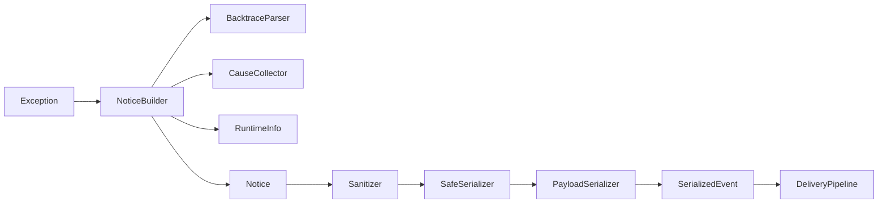

# Notice pipeline

The notice pipeline converts a Ruby `Exception` into a versioned JSON event.

`Notice` is immutable. Parsers are stateless. Raw notice values exist only in process memory. The sanitizer removes sensitive keys and recognized personal data before the safe serializer accepts JSON primitives, bounds nested structures, tolerates invalid encoding, and represents unknown objects without arbitrary application serialization.

Version 0.3 passes the serialized event to `DeliveryPipeline`. The pipeline applies remote sampling and exact fingerprint policy before serialization where possible, then manages queueing, retry, circuit state, and bounded memory backlog without changing transport or queue code.

Unit and contract tests verify missing backtraces, cyclic causes, invalid encoding, unsafe objects, payload limits, and the v1 envelope.
