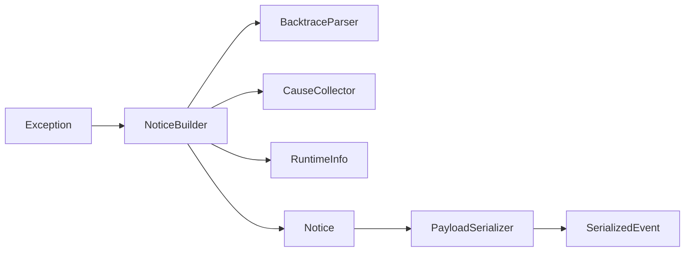

# Notice pipeline

The notice pipeline converts a Ruby `Exception` into a versioned JSON event.

`Notice` is immutable. Parsers are stateless. The serializer accepts only JSON primitives, bounds nested structures, tolerates invalid encoding, and represents unknown objects without arbitrary `to_json` calls.

Version 0.1 deliberately excludes the advanced sanitizer, sampler, and fingerprint policy. These can be inserted before serialization without changing transport or queue code.

Unit and contract tests verify missing backtraces, cyclic causes, invalid encoding, unsafe objects, payload limits, and the v1 envelope.
