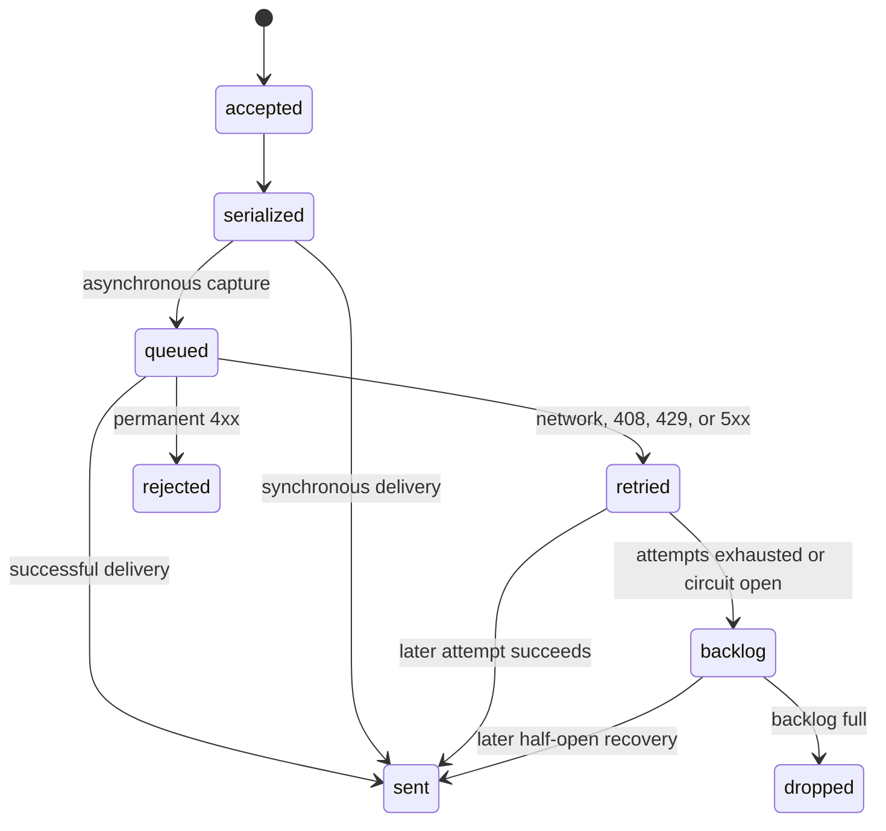

# Retry and backlog module

## Problem

Transient endpoint failures must not discard every event immediately, block application threads indefinitely, or grow memory without a limit.

## Boundary

Retry belongs to `Chronos::Application::DeliveryPipeline`, not `NetHttpTransport`, because HTTP classifies an outcome while application policy decides whether another attempt is acceptable. `Chronos::Internal::MemoryBacklog` is separate from the asynchronous queue because it stores failed deliveries, not newly accepted work.

## Data flow



`RetryPolicy` calculates exponential backoff with positive bounded jitter. `Retry-After` is respected only within `retry_max_interval`. `CircuitBreaker` opens after the configured consecutive failure count, rejects concurrent probes, and permits one half-open probe after `circuit_reset_timeout`.

The memory backlog accepts only `SerializedEvent`. Sanitization and safe serialization therefore happen before an event can enter retry storage. Its capacity is `backlog_size`; zero disables retention. The oldest stored event is attempted as new delivery activity arrives. No background timer or additional thread exists for backlog draining.

## Configuration and extension

```ruby
Chronos.configure do |config|
  # connection settings omitted
  config.max_retries = 3
  config.retry_base_interval = 0.5
  config.retry_max_interval = 30.0
  config.retry_jitter = 0.25
  config.backlog_size = 100
  config.circuit_failure_threshold = 5
  config.circuit_reset_timeout = 30.0
end
```

Tests may inject a clock, sleeper, random source, backlog, or retry policy into `DeliveryPipeline`. These are internal composition points rather than stable public configuration APIs.

## Risks and limits

- Events in memory are lost on process exit.
- A quiet process does not drain backlog until another event triggers delivery.
- Backlog order is best effort when multiple workers are active.
- Retry sleeps occupy a fixed worker, never the application caller for asynchronous capture.
- Synchronous capture waits for configured retries and should be used only when that latency is acceptable.
- Disk persistence is deliberately excluded from version 0.3.

## Tests

Unit tests cover bounded exponential delay, retry limits, `Retry-After`, permanent `4xx`, circuit opening and half-open recovery, fixed backlog capacity, raw-object rejection, prolonged outage, state counters, and recovery draining. The privacy contract proves that fixture secrets do not enter backlog storage.
