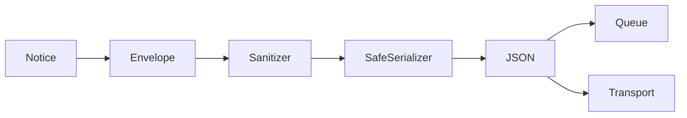

# Sanitization module

`Chronos::Core::Sanitizer` prevents raw secrets and common personal identifiers from crossing the serialization boundary. It is separate from `SafeSerializer`: privacy policy decides what may remain, while serialization decides which Ruby values can safely become JSON.

`Sanitizer` recursively processes hashes and arrays, supports String, Symbol, and Regexp key matchers, anonymizes IPv4 addresses, and optionally hashes selected scalar identifiers. `SensitiveValueFilter` validates and redacts common sensitive patterns in free text. Depth, visited nodes, hash keys, and array items are bounded before safe serialization. Custom filters can remove application-specific fields. A failing filter redacts its field and cannot interrupt the application.

The module deliberately does not inspect global variables, environment variables, request bodies, database records, or arbitrary object methods. Pattern detection can produce false positives or miss domain-specific formats, so applications must extend the blocklist and audit representative payloads.

Tests in `spec/unit/core/sanitizer_spec.rb` cover recursive keys, allowlisting, content detection, hashing, IP anonymization, and filter failure. `spec/contract/privacy_spec.rb` ensures sensitive fixtures never occur in the final JSON payload.
