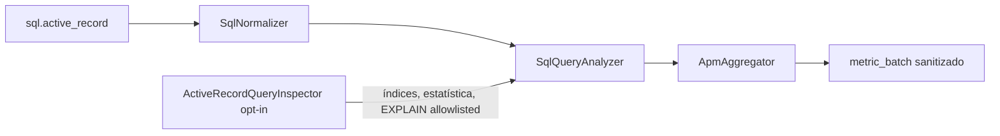

# Monitoramento SQL

## Problema e limites

O monitoramento SQL mede padrões de acesso e duração sem transmitir SQL bruto ou binds. Ele identifica query lenta/repetida, possível N+1, transação longa, famílias de erro e candidatos a índice. Recomendações são evidências heurísticas: a gem não cria índices, não executa DDL, não usa `EXPLAIN ANALYZE` e não substitui revisão do DBA.

## Fluxo e classes



`Rails::NotificationsSubscriber` extrai campos permitidos. `Core::SqlNormalizer` remove comentários e literais, limita identificadores e calcula fingerprint SHA-256. `Core::SqlQueryAnalyzer` analisa somente o `SELECT` normalizado, extrai tabelas e colunas de igualdade, faixa, join e ordenação e produz candidatos limitados. `Rails::ActiveRecordQueryInspector` implementa a porta `Ports::QueryInspector` e, quando habilitado, compara o candidato com índices existentes, lê estimativa de linhas e obtém plano sem executar a consulta.

O inspector envia somente nomes limitados de tabela/índice/coluna, estimativa de linhas e nós de plano allowlisted: tipo, tabela, índice, custo e linhas estimadas. Predicados, filtros, valores, SQL original e mensagens de erro são descartados. Falhas viram apenas classe limitada em um diagnóstico `error`.

`Application::ApmAggregator` agrega no grupo da query:

- `severity_counts`: `error`, `warning`, `info` e `suggestion`;
- `diagnostics`: até 20 diagnósticos estáveis com código, categoria, evidência e contagem;
- `query_analysis`: uma análise representativa, preferindo a observação com inspeção mais rica;
- `signals`: contadores compatíveis de slow query, repetição, N+1, transação e erros;
- duração total/mínima/máxima/média, histograma e p50/p95/p99 aproximados.

## Severidades

| Severidade | Exemplos |
|---|---|
| `error` | exceção SQL, conexão, pool/statement/lock timeout, deadlock, constraint e falha da inspeção |
| `warning` | query lenta, transação longa, possível N+1 e sequential scan observado |
| `info` | padrão normalizado analisado, query repetida e índice existente que cobre o padrão |
| `suggestion` | candidato de índice e uso de eager/batch loading para possível N+1 |

No projeto consumidor, cada item de `diagnostics` pode ser persistido como informação associada à métrica usando `code`, `severity`, `category`, `message`, `recommendation`, `evidence` e `count`. `code + severity + evidence.table + evidence.columns` forma a identidade agregada atual. O consumidor deve usar `severity` para apresentação e ordenação, não inferir severidade pelo texto. Campos desconhecidos devem ser preservados ou ignorados para manter compatibilidade aditiva.

Um candidato permanece `unverified` até o catálogo ser consultado. Ele se torna `covered` quando um índice possui o prefixo observado ou `missing` quando índices foram lidos e nenhum cobre esse prefixo. Seletividade, custo de escrita e distribuição de dados ainda precisam ser avaliados antes de qualquer migração.

## Configuração segura

```ruby
Chronos.configure do |config|
  config.apm_slow_query_threshold_ms = 500.0
  config.apm_n_plus_one_threshold = 5
  config.apm_trace_ttl_seconds = 60.0
  config.apm_query_analysis_enabled = true
  config.apm_query_analysis_max_queries = 100

  # Opt-in por adicionar consultas de somente leitura ao banco.
  config.apm_query_inspection_enabled = true
  config.apm_query_statistics_enabled = true
  config.apm_query_plan_enabled = true
  config.apm_query_inspection_min_duration_ms = 500.0
  config.apm_query_inspection_max_queries = 20
end
```

A análise normalizada é ativada por padrão, não consulta o banco e é calculada uma vez por fingerprint até o limite do cache. Inspeção, estatísticas e plano são desativados por padrão. Cada fingerprint é inspecionado no máximo uma vez por subscriber até o limite configurado; uma inspeção posterior pode enriquecer a análise estática já armazenada. PostgreSQL usa `pg_class` e `EXPLAIN (FORMAT JSON)`; MySQL/Trilogy usa `information_schema` e `EXPLAIN`. Adapters não reconhecidos ainda recebem análise estática e índices caso exponham `connection.indexes`.

## Transações e N+1

O subscriber mede o intervalo aproximado entre os callbacks de `BEGIN`/`START TRANSACTION` e `COMMIT`/`ROLLBACK`, por identidade local da conexão. Savepoints não encerram a transação externa. Estados ociosos expiram e conexões rastreadas são limitadas. O valor não inclui o tempo gasto antes do callback de `BEGIN` nem depois do callback final.

Possível N+1 exige `SELECT` não cacheado, mesmo fingerprint, mesmo trace e repetição até o threshold. A sugestão recomenda eager loading ou carregamento em lote, mas o consumidor deve confirmar a semântica antes da alteração.

## Riscos e extensão

`EXPLAIN` ainda usa planner, conexão e locks leves de catálogo; por isso é opt-in e selecionado por duração. Não existe timeout portátil entre os adapters legacy, então habilite primeiro em staging e monitore o orçamento. Nomes de schema/tabela/coluna/índice podem revelar o domínio e precisam de avaliação LGPD.

Um inspector alternativo pode implementar `call(raw_sql, query, options)` e retornar `indexes`, `statistics`, `plan` e `errors` nos limites do contrato. Ele deve ser somente leitura e nunca devolver valores ou mensagens livres.

Os testes principais são `spec/unit/core/sql_query_analyzer_spec.rb`, `spec/unit/rails/active_record_query_inspector_spec.rb`, `spec/unit/application/apm_aggregator_spec.rb` e `spec/integration/rails_telemetry_delivery_spec.rb`. O exemplo executável está em `examples/plain-ruby/query_analysis.rb`.
